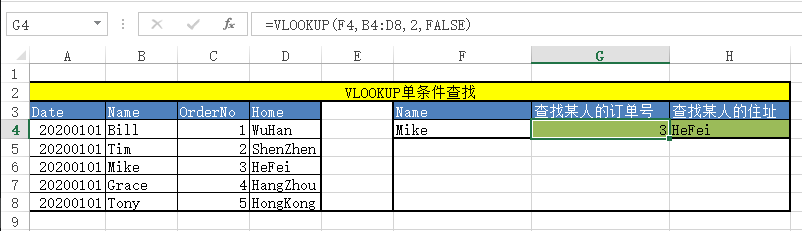
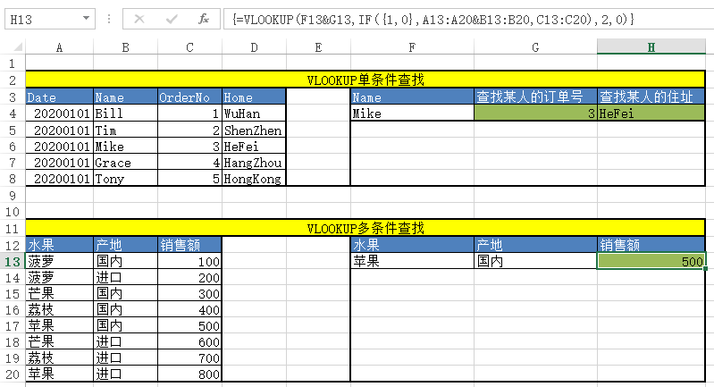

# VLOOKUP函数

***

## 概述

* 在Excel中，只要是找东西，大家都会想到`VLOOKUP`函数

## VLOOKUP

* `VLOOKUP`函数语法如下

  VLOOKUP(根据什么找, 到哪里找, 找哪个, 怎么找)
  
  说明：
  1、"根据什么找"中的"什么"一定要位于"到哪里找"区域的第一列
  2、若从"到哪里找"区域中找到多个结果，则仅返回第一个结果
  3、"找哪个"为列号，而且是"到哪里找"区域中的第几列
  4、"怎么找"可取值：TRUE(模糊查找，首列必须升序排列)，FALSE(精确查找)，默认是模糊查找

* 举例：

  现有表格如下：[Excel 学习用的测试文件](./Excel Study.xlsx)

​	解读：VLOOKUP(F4,B4:D8,2,FALSE)

​	1、在区域`B4:D8`中查找`B列`值等于`F4`单元格的行，取该区域第2行（也就是OrderNo）的值。查找方式为精确查找

## VLOOKUP多条件查找

* `VLOOKUP多条件查找`需要使用数组公式，语法如下：

  VLOOKUP(条件1&条件2,IF({1,0},条件1对应的列区域&条件2对应的列区域,查找值所在列区域),找哪个,怎么找)

  说明：

  1、`&`是连接符。条件1&条件2连接为一个字符串作为总的查找条件

  2、IF({1,0},条件1对应的列区域&条件2对应的列区域,查找值所在列区域)是一个数组公式，返回一个区域，该区域第一列是由条件1对应的列区域和条件2对应的列区域通过`&`运算得到，第二列是查找值所在的列。

  3、找哪个为列号，是到步骤2生成的区域里找第几列的值

  4、"怎么找"可取值：TRUE(模糊查找，首列必须升序排列)，FALSE(精确查找)，默认是模糊查找

* 举例：

  现有表格如下：[Excel 学习用的测试文件](./Excel Study.xlsx)

  

  解读：{=VLOOKUP(F13&G13,IF({1,0},A13:A20&B13:B20,C13:C20),2,0)}

  1、F13&G13,连接字符串。即根据"苹果国内"查找

  2、IF({1,0},A13:A20&B13:B20,C13:C20)为数组公式，返回一个两列的数组，第一列是`A13:A20`&`B13:B20`的结果，第二列是`C13:C20`

  3、`2`代表查找上面区域的第2列

  4、`0`代表精确查找

  5、由于使用了数组公式，所以公式输入完之后不能按`Enter`,应该是`Shift+Control+Enter`。`{}`表明这是一个数组公式

